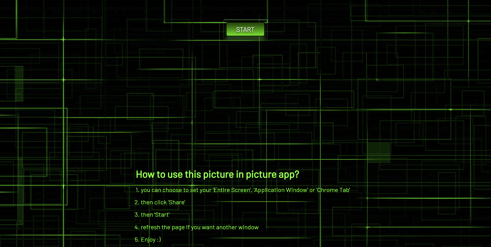

<h1 align='center'> PICTURE IN PICTURE </h1>

## This project is based on the ["JavaScript Web Projects: 20 Projects to Build Your Portofolio"](https://www.udemy.com/course/javascript-web-projects-to-build-your-portfolio-resume/)
